# MemPalace State Machine Diagrams

Visual maps of every major flow in MemPalace.

---

## 1. System Overview

The high-level lifecycle of data through MemPalace.

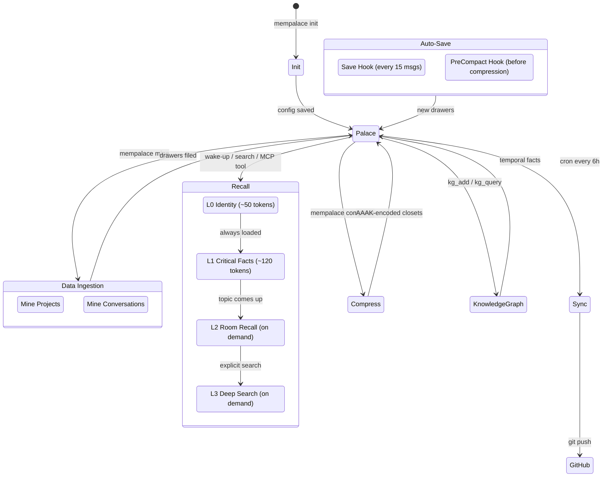

---

## 2. Initialization / Onboarding

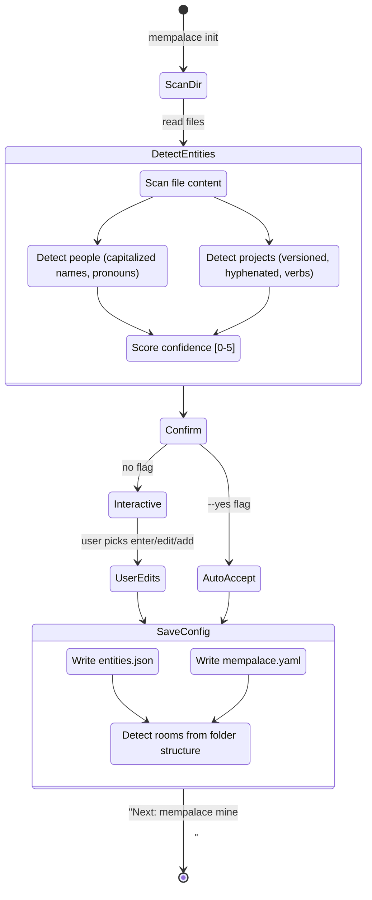

---

## 3. Mining — Project Files

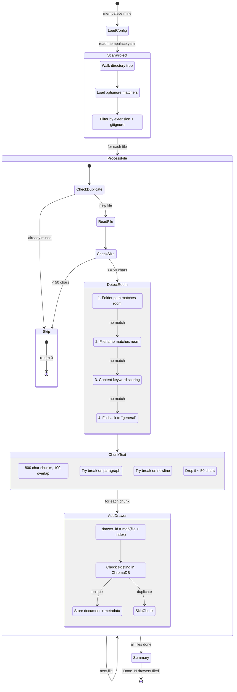

---

## 4. Mining — Conversations

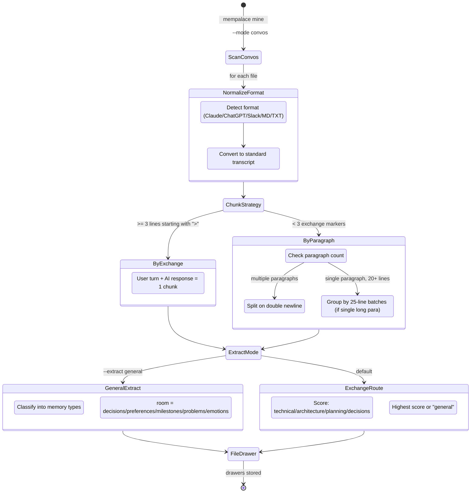

---

## 5. Search Flow

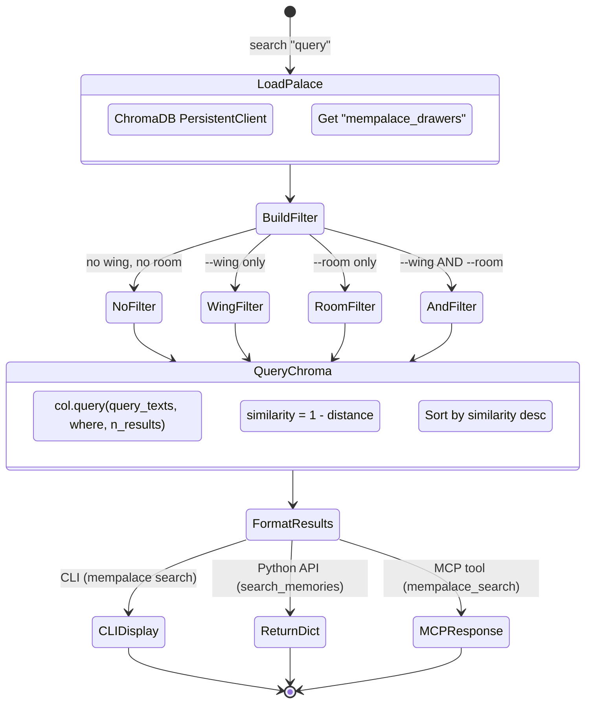

---

## 6. Memory Stack (Wake-Up)

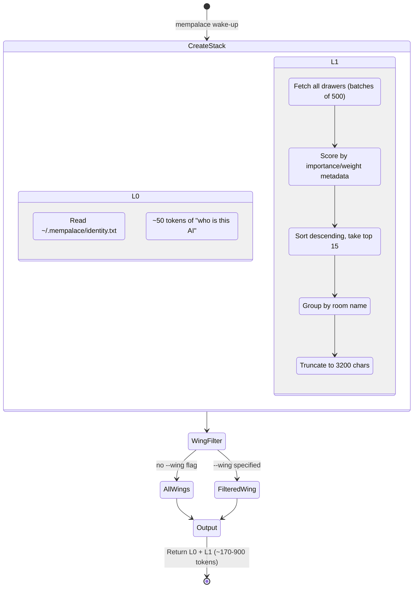

---

## 7. Save Hook State Machine

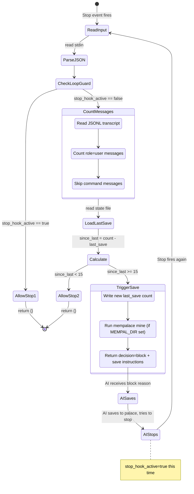

---

## 8. PreCompact Hook State Machine

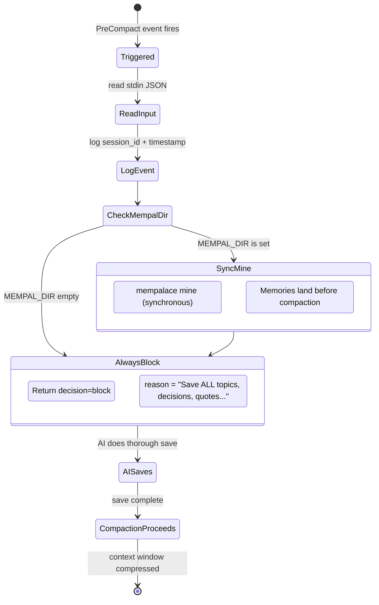

---

## 9. Knowledge Graph Operations

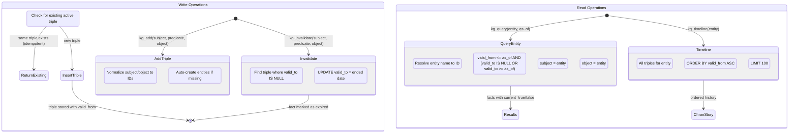

---

## 10. Palace Graph Navigation

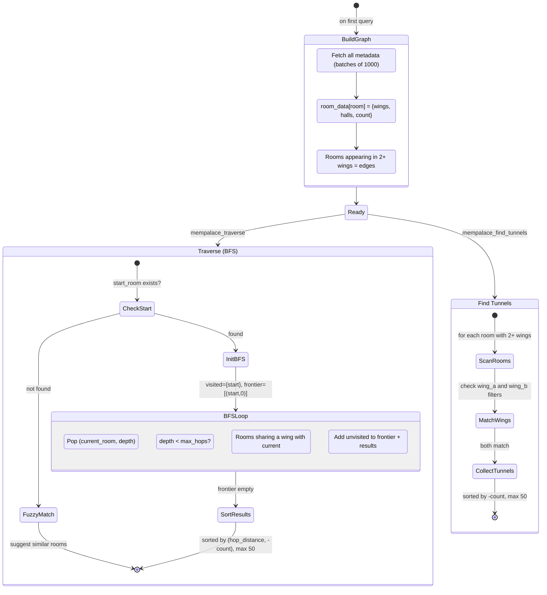

---

## 11. AAAK Compression

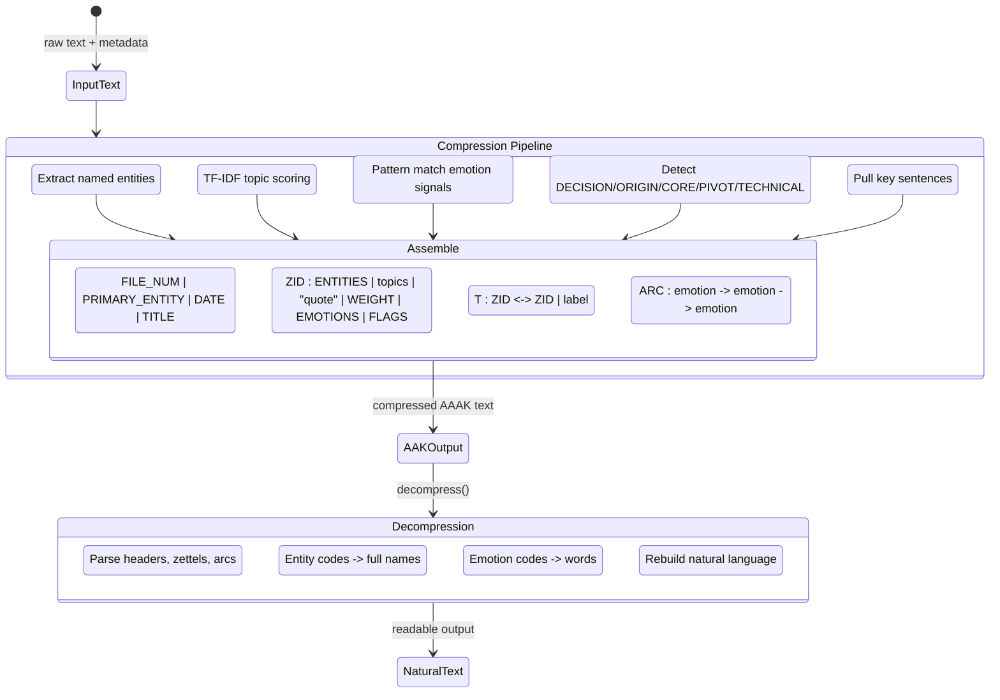

---

## 12. MCP Server — Tool Dispatch

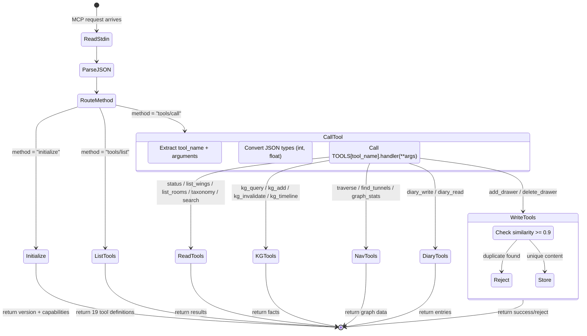

---

## 13. Auto-Sync to GitHub

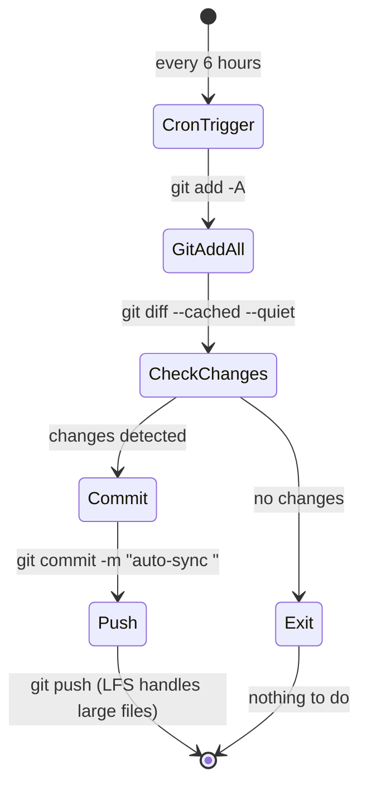
